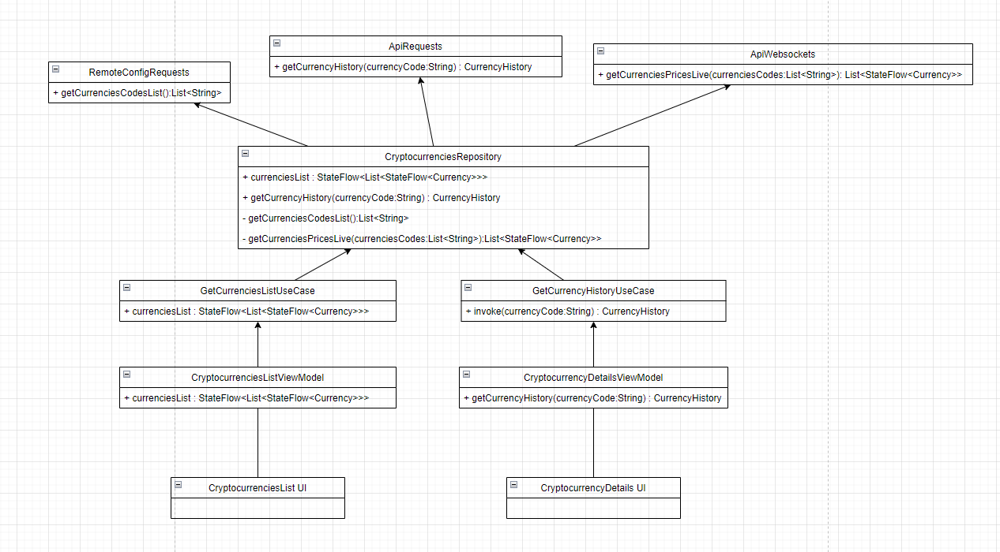
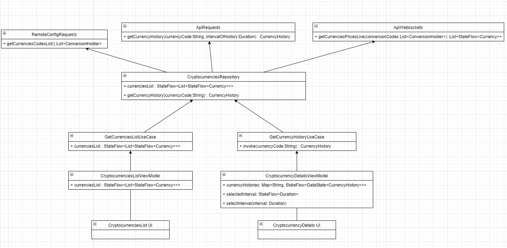

This application created to complete [this task](./task.txt)

Application architecture beforehand:

Actual application architecture:

Application uses these libraries: Jetpack Compose, Retrofit, OkHttp, Coroutines Flow, Hilt,
Architecture Components.

Application uses Firebase Remote Config to fetch cryptocurrencies to monitor. google-services.json
does not included in repository. You should create custom firebase with these parameters:

currenciesCodes - codes of currencies to monitor separated by space (Example: "BTC ETH DOGE LTC BNB XRP").

convertTo - code of currency to show price of all other currencies (Example: "USDT").

Application uses [Binance API](https://binance-docs.github.io/apidocs) to track currencies' price.

Application supports dark and light theme. To switch, just change your device's theme.
